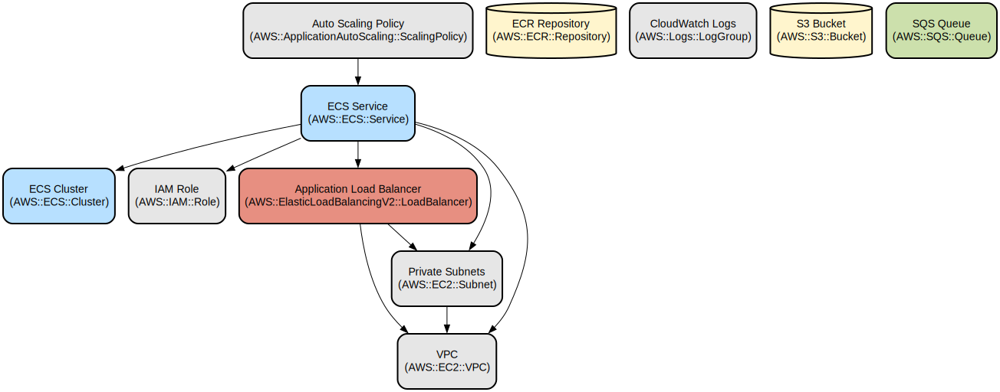

# Go File Storage Service with AWS ECS Deployment

A containerized Go web service that provides file storage capabilities with AWS ECS deployment infrastructure. The service offers RESTful endpoints for file operations with automatic scaling and high availability through AWS infrastructure.

This project combines a Go-based file storage microservice with Infrastructure as Code (IaC) using Terraform for AWS ECS deployment. The service provides endpoints for file upload, retrieval, and listing operations while leveraging AWS ECS for container orchestration, ECR for container registry, and EFS for persistent storage. The infrastructure includes auto-scaling capabilities based on CPU utilization and request volume.

## Repository Structure
```
.
├── app/                          # Application source code directory
│   ├── Dockerfile               # Multi-stage Docker build configuration
│   ├── main.go                  # Main application entry point with HTTP endpoints
│   └── main_test.go            # Application test suite
├── pipeline.sh                  # CI/CD pipeline script for building and deployment
└── terraform/                   # Infrastructure as Code directory
    ├── backend.tf              # Terraform backend configuration
    ├── data.tf                # AWS resource data source definitions
    ├── iam.tf                 # IAM roles and policies
    ├── main.tf                # Main ECS service configuration
    ├── output.tf              # Terraform outputs
    ├── providers.tf           # AWS provider configuration
    └── variables.tf           # Infrastructure variable definitions
```

## Usage Instructions
### Prerequisites
- Go 1.x
- Docker
- AWS CLI configured with appropriate credentials
- Terraform >= 0.12
- AWS Account with permissions for:
  - ECS
  - ECR
  - IAM
  - VPC
  - EFS
  - Systems Manager Parameter Store

### Installation

#### Local Development
```bash
# Clone the repository
git clone <repository-url>
cd <repository-name>

# Build and run the Go application locally
cd app
go mod download
go run main.go
```

#### Docker Build
```bash
cd app
docker build -t file-storage-service .
docker run -p 8080:8080 file-storage-service
```

#### AWS Deployment
```bash
# Deploy infrastructure and application
./pipeline.sh
```

### Quick Start
1. Start the service:
```bash
cd app
go run main.go
```

2. Test the endpoints:
```bash
# Health check
curl http://localhost:8080/healthcheck

# Upload a file
curl -X POST -d "file content" http://localhost:8080/arquivos

# List files
curl http://localhost:8080/arquivos

# Get file content
curl http://localhost:8080/arquivos/<uuid>
```

### More Detailed Examples
```go
// Upload a file
curl -X POST \
  http://localhost:8080/arquivos \
  -d 'This is the file content'

// Response:
{
  "message": "Arquivo salvo com sucesso",
  "file": "/mnt/efs/<uuid>.txt"
}

// List all files
curl http://localhost:8080/arquivos

// Response:
{
  "files": ["<uuid1>.txt", "<uuid2>.txt"]
}
```

### Troubleshooting
1. Container Startup Issues
   - Check ECS service logs in CloudWatch
   - Verify ECS task execution role permissions
   - Command: `aws ecs describe-services --cluster <cluster-name> --services <service-name>`

2. File Storage Issues
   - Verify EFS mount permissions
   - Check EFS mount point: `/mnt/efs`
   - Logs: `docker logs <container-id>`

3. Deployment Issues
   - Check Terraform state: `terraform show`
   - Verify AWS credentials: `aws sts get-caller-identity`
   - Pipeline logs: Check CI/CD pipeline output

## Data Flow
The service handles file storage operations through a RESTful API, storing files in EFS with UUID-based naming.

```ascii
Client Request -> ECS Service -> EFS Storage
     ↑               |              |
     |               v              |
     └---------- Response <---------┘
```

Key component interactions:
1. Client sends HTTP requests to ECS service endpoints
2. ECS tasks process requests using Go Fiber framework
3. Files are stored in EFS with UUID identifiers
4. Auto-scaling adjusts capacity based on CPU/request metrics
5. IAM roles control service permissions

## Infrastructure


### ECS Resources
- ECS Service with Fargate launch type
- Task Definition with configurable CPU/memory
- Auto-scaling policies based on CPU utilization

### IAM Resources
- Task Execution Role with permissions for:
  - CloudWatch Logs
  - ECR access
  - S3 operations
  - SQS operations

### Networking
- VPC with private subnets
- Application Load Balancer
- Security groups for ECS tasks

## Deployment
Prerequisites:
- AWS credentials configured
- Terraform installed
- Docker installed

Deployment steps:
1. Run `./pipeline.sh` for full CI/CD pipeline execution
2. Pipeline performs:
   - Go tests and linting
   - Docker image build and push to ECR
   - Terraform infrastructure deployment
   - ECS service deployment